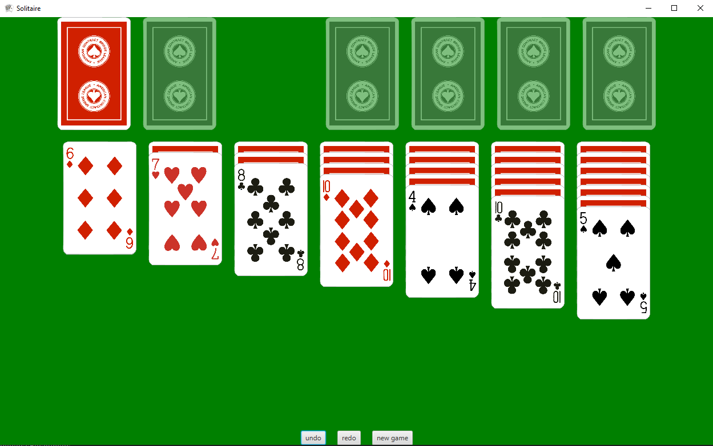
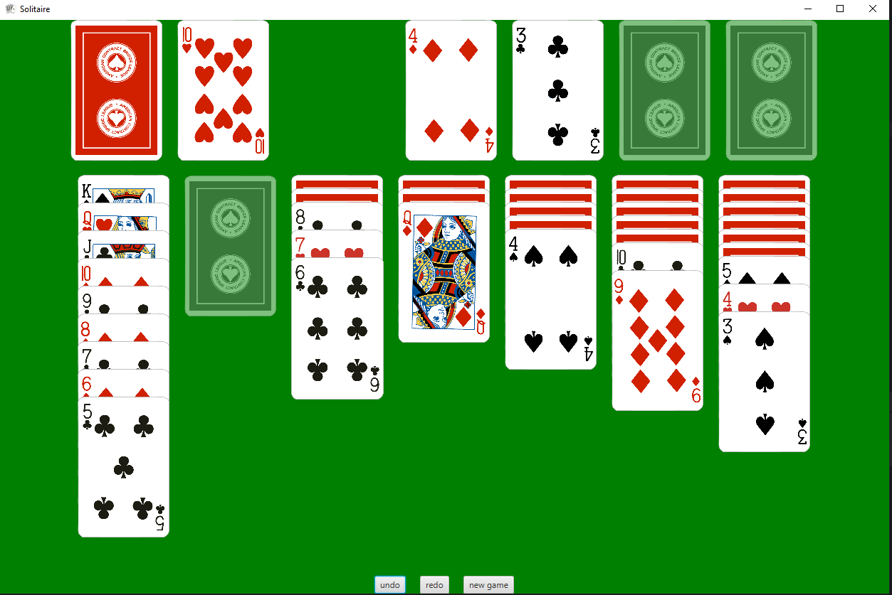

# Solitare Game
### Overview

This project is a Solitaire card game implemented in Java using JavaFX for the 
graphical interface. It is a single-player game where the objective is to 
organize a shuffled deck of cards into four foundation piles, sorted by suit 
and in ascending order. I created this project in my free time and plan to enhance 
it with additional features and improvements in the future.

### Dependencies

- Java 19: Ensure that Java 19 is installed in your environment.

- JavaFX: Required for building the graphical user interface.

### How to Play

- Click on a card witch you want to select and move.
- Then click on the card witch you want to move the selected card.
- Follow classic Solitaire rules to organize the cards into foundation piles.
- Use the Undo and Redo buttons to correct or revert actions.
- Start a fresh game at any time with the New Game button.

### Planned Features

- Timer and Scoreboard: Track the player's time and score for each game.
- Themes and Customization: Allow users to change card designs and background themes.
- Hint System: Provide hints to guide players on possible moves.
- Multithreading: Implement multithreading to improve performance and responsiveness.
- Redesign Application Appearance: Improve the overall user interface and visual aesthetics of the game.
- Menu and Other game modes: Add a menu to the game and other game modes like Spider Solitaire.

